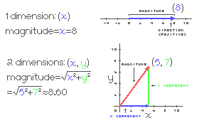

# Lesson 1
*meow!*

## Our progress so far:
* The player’s ball can move and look around
* That’s it (but good work still!)

## Objectives:
* Make the camera third-person
* Add jumping
* Add collectible pickups

## Some prerequisite physics
I realized we haven’t talked much about what vectors and quaternions even are.
We'll be working with them everywhere so it's SUPER important to know the fundamentals.
Starting from the ground up:

### Scalar
Google definition:
> (of a quantity) having only magnitude, not direction.

Magnitude means size, or *scale*.
Scalars are quantities that ONLY have scale, most commonly stored as a `float` or `int`.
Note that `float` and `int` are signed types, so if the result of a calculation can be either positive or negative, they CAN have direction.
In that case they wouldn't represent a scalar quantity but a 1-dimensional vector.

### Vector
Google definition:
> a quantity having direction as well as magnitude

When we use vectors in gamedev, we're almost certainly working with their cartesian representation.
That means each component of a vector is the distance from zero in it's respective spatial dimension.

  
(I just realized the equations in this graphic are wrong because you also need to take the absolute value before you end up with magnitude, whoops LOL)

In Unity, the `Vector3` structure appears EVERYWHERE.
We use vectors to represent position, scale, direction, offset, force, mesh verticies, etc.
If it exists in 3D, it's a vector. 

Manipulating vectors via airthmetic enables us to do a bunch of cool stuff. Like moving!

```cs
[RequireComponent(typeof(Rigidbody))]
public class Player : MonoBehaviour
{
    public float speed = 3;

    private Rigidbody rb;

    void Start()
    {
        rb = GetComponent<Rigidbody>();
    }

    void FixedUpdate()
    {
        // Unity's input system abstracts away WASD into the "Horizontal" and "Vertical" axes
        // which range from -1 to +1, making it super convenient to work with.
        float horizontal = Input.GetAxis("Horizontal");
        float vertical = Input.GetAxis("Vertical");

        Vector3 inputDirection = new Vector3(horizontal, 0, vertical);

        // There's a problem with this. If the player presses W and D at the same time,
        // inputDirection would be (1, 0, 1). The magnitude of (1, 0, 1) is the square root of 2,
        // approx 1.4. This would result in the player going 40% faster by moving diagonally
        // which isn't desirable. To make the vector always have a magnitude of 1, we need to
        // normalize it.
        inputDirection.Normalize();

        rb.AddForce(speed * inputDirection, ForceMode.Force);
    }
}
```

In this example, we construct a *unit vector* from the player's WASD input.
A unit vector is just a vector that has a magnitude of 1.
When you multiply a vector by a scalar, the direction stays the same but the magnitude gets multiplied.

When we do `speed * inputDirection` we're creating a force vector to push the player `speed` meters per second in the direction of `inputDirection`.

That's cool and all, but now I'd like to jump!

```cs
[RequireComponent(typeof(Rigidbody))]
public class Player : MonoBehaviour
{
    public float speed = 3;
    public float jumpForce = 5;

    private Rigidbody rb;

    void Start()
    {
        rb = GetComponent<Rigidbody>();
    }

    void FixedUpdate()
    {
        float horizontal = Input.GetAxis("Horizontal");
        float vertical = Input.GetAxis("Vertical");

        Vector3 inputDirection = new Vector3(horizontal, 0, vertical);
        inputDirection.Normalize();

        rb.AddForce(speed * inputDirection, ForceMode.Force);

        if (Input.GetButtonDown("Jump"))
        {
            // Use ForceMode.Impulse to apply the force instantly
            rb.AddForce(jumpForce * Vector3.up, ForceMode.Impulse);
        }
    }
}
```

No new concepts here, we're just multiplying a scalar by a unit vector again to create an upwards force vector.
Jumping only involves going in the up direction, so we can make use of the `Vector3.up` constant which is equal to (0, 1, 0).
Unity provides [a bunch of `Vector3` constants](https://docs.unity3d.com/ScriptReference/Vector3.html) like that for our convenience.

(sorry I was gonna cover quaternions in this lesson but the explaination for vectors ended up being so lengthy and I've already delayed our lesson so much so so so 😭 we'll get to it next time!!!)
